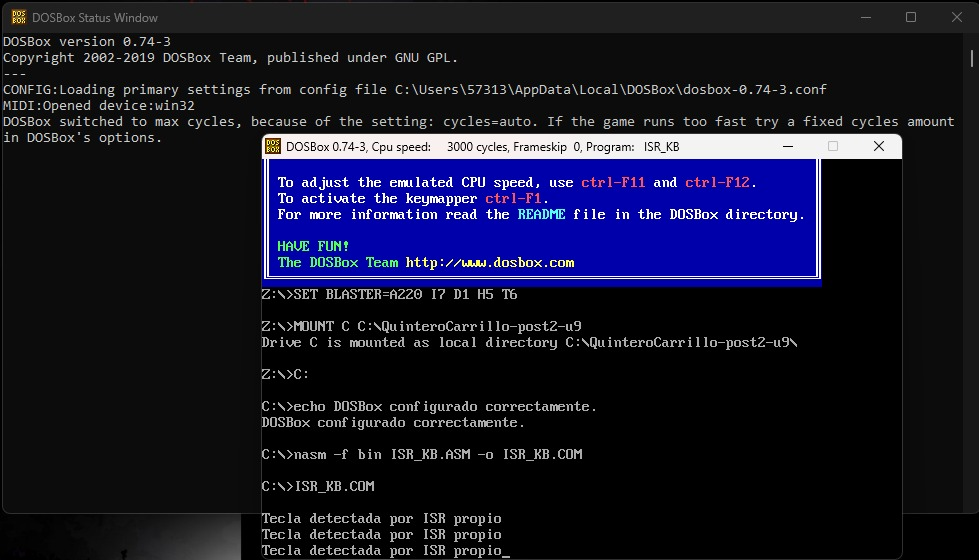
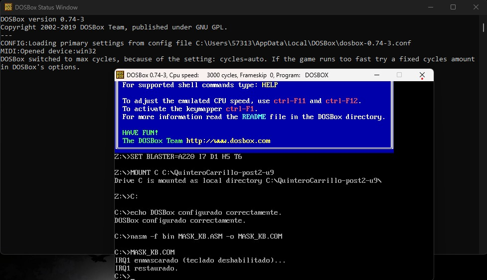
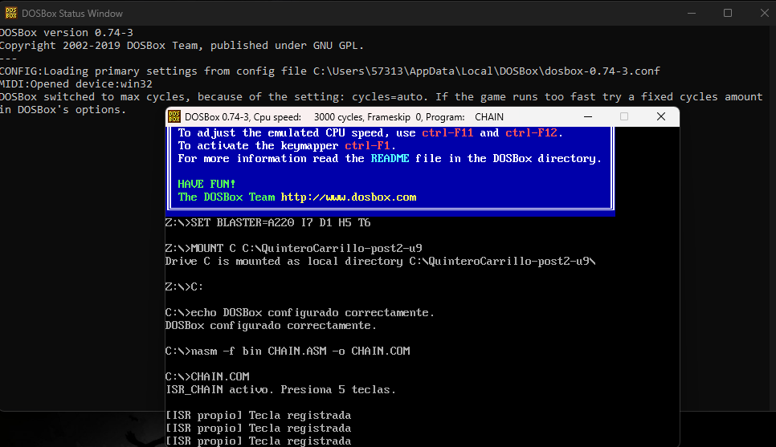

# Quintero-Carrillo-Post2-U9
Laboratorio Post-Contenido 2 Unidad 9 -  Entrada y Salida Avanzados - Arquitectura de Computadores

## Objetivo

Implementar una Rutina de Servicio de Interrupción (ISR) personalizada en
ensamblador x86 (NASM + DOSBox) que reemplaza temporalmente el handler del
IRQ1 (teclado), programa el PIC 8259A para enmascarar y desenmascarar
interrupciones, y verifica el flujo completo de atención de interrupción
hardware en DOSBox.

---

## Prerrequisitos

| Requisito             | Detalle                                                        |
|-----------------------|----------------------------------------------------------------|
| Software              | DOSBox 0.74-3 con NASM 2.x accesible desde el prompt de DOS   |
| Conocimientos previos | Tabla de vectores de interrupción (IVT), INT 21h AH=25h/35h para instalar/obtener handlers, flag IF, PIC 8259A             |             |
| Directorio de trabajo | C:\QuinteroCarrillo-post2-u9\ dentro de DOSBox                 |

---

## Conceptos Clave

El PIC 8259A maestro traduce las líneas IRQ 0–7 a vectores de interrupción.
Por defecto en modo DOS real, el vector base del PIC maestro es 08h:

- IRQ0 (Timer)   → INT 08h (vector 0x08)
- IRQ1 (Teclado) → INT 09h (vector 0x09)
- IRQ7 (LPT1)    → INT 0Fh (vector 0x0F)

El IMR (Interrupt Mask Register) reside en el puerto 21h. Un bit en 1
enmascara (deshabilita) la IRQ; un bit en 0 la habilita. El EOI (End Of
Interrupt) se envía al puerto 20h para indicar que el ISR ha terminado.

---

## Programas

### ISR_KB.ASM — ISR Personalizado para IRQ1

Reemplaza temporalmente el handler de INT 09h con uno propio. El programa:

1. Guarda el vector original de INT 09h usando AH=35h (INT 21h).
2. Instala el ISR propio apuntando DS:DX al nuevo handler con AH=25h.
3. El ISR propio lee el scancode del puerto 60h, muestra un mensaje por
   cada pulsación e incrementa un contador.
4. Envía EOI (0x20) al puerto 0x20 al finalizar cada atención.
5. Al alcanzar 5 pulsaciones restaura el handler original y termina.

**Compilación:**
```
nasm -f bin ISR_KB.ASM -o ISR_KB.COM
```

**Ejecución:**
```
ISR_KB
```

**Resultado esperado:** Al presionar 5 teclas muestra "Tecla detectada por
ISR propio" exactamente 5 veces, luego muestra "ISR restaurado. Fin del
programa." y termina correctamente.

**Checkpoint 1 verificado:**



---

### MASK_KB.ASM — Enmascaramiento del IRQ1 con el IMR

Enmascara temporalmente el IRQ1 poniendo a 1 el bit 1 del IMR (puerto 21h),
espera aproximadamente 3 segundos usando el timer BIOS (INT 1Ah, 18.2
ticks/seg ≈ 55 ticks), y restaura el IMR original. Durante el enmascaramiento
las pulsaciones de teclado no generan interrupciones visibles.

**Compilación:**
```
nasm -f bin MASK_KB.ASM -o MASK_KB.COM
```

**Ejecución:**
```
MASK_KB
```

**Resultado esperado:** Muestra "IRQ1 enmascarado (teclado deshabilitado)..."
y durante ~3 segundos las teclas no producen salida. Al finalizar muestra
"IRQ1 restaurado." y termina correctamente.

**Checkpoint 2 verificado:**



---

### CHAIN.ASM — Encadenamiento del ISR (ISR Chaining)

En lugar de reemplazar completamente el handler original, el encadenamiento
ejecuta código propio y luego llama al handler anterior mediante PUSHF +
CALL FAR [old_isr], simulando una INT para que el handler original reciba
el control correctamente. Esto permite que el sistema operativo siga
procesando la tecla con normalidad (eco en pantalla) mientras el ISR propio
registra las pulsaciones en su propio contador.

El encadenamiento es esencial cuando el ISR no procesa la interrupción
completamente — por ejemplo, un keylogger de depuración que registra teclas
sin interferir con el procesamiento normal del sistema operativo.

**Compilación:**
```
nasm -f bin CHAIN.ASM -o CHAIN.COM
```

**Ejecución:**
```
CHAIN
```

**Resultado esperado:** Al presionar teclas aparece "Tecla registrada
(ISR chain)" Y el eco normal de DOS sigue funcionando, demostrando el
encadenamiento correcto. Al alcanzar 5 pulsaciones muestra "Chain terminado.
ISR restaurado." y termina.

**Checkpoint 3 verificado:**



---

## Pasos de Compilación y Ejecución

Todos los archivos se compilan con NASM en formato binario plano para
generar programas .COM de modo real x86 de 16 bits:

```
nasm -f bin ISR_KB.ASM  -o ISR_KB.COM
nasm -f bin MASK_KB.ASM -o MASK_KB.COM
nasm -f bin CHAIN.ASM   -o CHAIN.COM
```

Los archivos .COM se ejecutan dentro de DOSBox desde el directorio montado:

```
ISR_KB
MASK_KB
CHAIN
```

---

## Estructura del Repositorio

```
QuinteroCarrillo-Post2-U9/
├── README.md
├── ISR_KB.ASM       — ISR personalizado para IRQ1
├── ISR_KB.COM       — Binario compilado
├── MASK_KB.ASM      — Enmascaramiento IRQ1 con PIC 8259A
├── MASK_KB.COM      — Binario compilado
├── CHAIN.ASM        — ISR con encadenamiento al handler original
├── CHAIN.COM        — Binario compilado
└── capturas/
    ├── checkpoint1.png   — ISR_KB mostrando 5 mensajes
    ├── checkpoint2.png   — MASK_KB con teclado enmascarado
    └── checkpoint3.png   — CHAIN con encadenamiento funcionando
```

---

## Comportamiento Observado en DOSBox

- **ISR_KB:** DOSBox simula correctamente el vector INT 09h. El ISR propio
  intercepta cada pulsación, muestra el mensaje y envía EOI al PIC antes
  de retornar con IRET.

- **MASK_KB:** Al enmascarar el bit 1 del IMR (puerto 21h), DOSBox deja de
  despachar interrupciones de teclado durante el retardo. El timer BIOS
  (INT 1Ah) sigue funcionando correctamente para medir los ~3 segundos.

- **CHAIN:** El encadenamiento mediante PUSHF + CALL FAR permite que el
  handler original de DOS procese la tecla normalmente después del código
  propio, demostrando coexistencia de handlers sin pérdida de funcionalidad.
